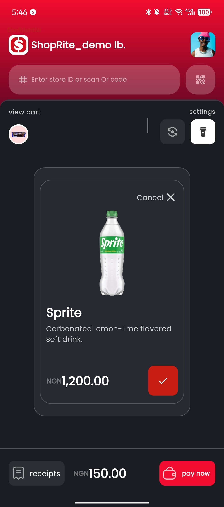
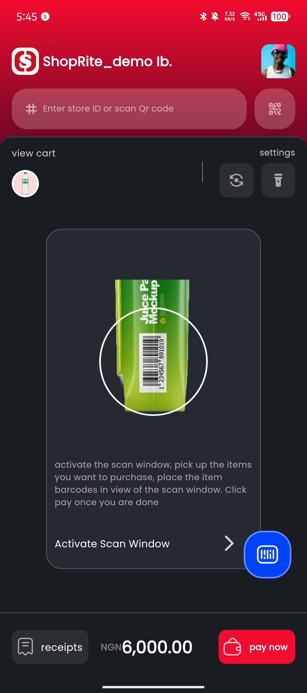
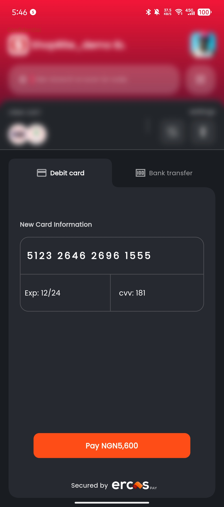

# Self-CHECKOUT: #NoLongQueues #SaferShopping

## Overview

Self-CHECKOUT is a mobile application that solves the problem of long queues and payment security risks in physical retail stores. Customers can easily scan product barcodes, view item details (price, expiry date, etc.), and complete payments securely via the ErcasPay API, all from their smartphones. This app ensures seamless, secure, and efficient shopping while also providing valuable insights to retail stores.

---

## Demo APK

[Download the APK here](https://drive.google.com/drive/folders/1A_5dLo_T4lEH2C7X3aaNjytVV4q6-_aR?usp=drive_link)

## Features

- **Store Identification**: Locate stores, view average pricing, and ratings within the app.
- **Product Barcode Scanning**: Scan product barcodes using Optical Character Recognition (OCR) for instant item details.
- **Real-Time Item Information**: View price, expiry date, and total shopping cost.
- **Secure Payments**: Integrated with the ErcasPay API for seamless payment options, including USSD, card, bank transfer, and QR code.
- **Digital Receipts**: Customers receive receipts digitally for convenience and tracking.
- **Recommender System**: Smart suggestions based on scanned items to enhance the shopping experience.

---

## Technology Stack

### Frontend

- **Flutter**: Cross-platform framework for building responsive mobile UIs (Android & iOS).

### Backend

- **Microsoft Azure & Firebase**: Reliable, scalable cloud infrastructure for backend processes and data storage.
- **Python**: For AI-based recommender systems and backend analytics.

### Key Integrations

- **ErcasPay API**: Secure and multi-option payment gateway integration.
- **OCR (Optical Character Recognition)**: Enables barcode scanning for instant product details.

---

## Installation

To run this project locally, follow these steps:

1. **Clone the Repository**:

   ```bash
   git clone https://github.com/your-username/self-checkout.git
   cd self-checkout
   ```

2. **Install Dependencies**:
   Make sure Flutter and Dart are installed on your machine, then run:

   ```bash
   flutter pub get
   ```

3. **Run the Application**:
   Launch the app using an emulator or connected device:

   ```bash
   flutter run
   ```

## App Flow

1. **Select Store**: The user selects the retail store within the app.
2. **Scan Items**: Barcodes are scanned using the device's camera, retrieving real-time item details.
3. **View Total**: Users can view individual prices and the total shopping cost in real time.
4. **Secure Payment**: Payments are processed through the ErcasPay API.
5. **Digital Receipt**: A receipt is generated and stored digitally for user records.

---

## Project Structure

```
self-checkout/
├── lib/
│   ├── main.dart          # Entry point of the application
│   ├── screens/           # UI screens (e.g., Home, Scan, Payment)
│   ├── services/          # Backend API and ErcasPay integrations
│   ├── utils/             # Utility classes and helpers
│   ├── widgets/           # Reusable widgets
│   └── models/            # Data models
├── assets/                # Images, icons, and assets
├── pubspec.yaml           # Dependencies
└── README.md              # Documentation
```

---

## Team Contributions

- **Ogunmuyiwa Stephen** (Mobile Developer): Flutter app development, frontend/backend integration.
- **Olufemi Victor** (AI Engineer): Recommender system, analytics dashboard.
- **Kausar Moshood** (Product Designer/Manager): UI/UX design, project management.

---

## Screenshots

1. **Home Screen**  
   

2. **Barcode Scanning**  
   

3. **Payment Screen**  
   

---

## Future Improvements

- Loyalty programs for returning customers.
- Enhanced AI for dynamic pricing strategies.
- Offline support for scanning and payments.

---

## License

This project is licensed under the MIT License. See the `LICENSE` file for more details.

---

## Contact

For inquiries or collaboration:

- **Ogunmuyiwa Stephen**: <stephenogunmuyi1@gmail.com>
- **Olufemi Victor**: <femiosinkolu@gmail.com>
- **Kausar Moshood**: <kausarmoshood@gmail.com>

---

**Self-CHECKOUT: #NoLongQueues #SaferShopping 🚀**
